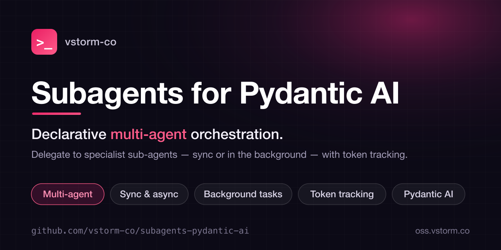

<p align="center">
  
</p>

<h1 align="center">Subagents for Pydantic AI</h1>

<p align="center">
  <b>Declarative multi-agent orchestration.</b><br>
  Delegate to specialist sub-agents — sync, async, or auto — with token tracking and cancellation.
</p>

<p align="center">
  <a href="https://vstorm-co.github.io/subagents-pydantic-ai/">Docs</a> &middot;
  <a href="https://pypi.org/project/subagents-pydantic-ai/">PyPI</a> &middot;
  <a href="#installation">Install</a> &middot;
  <a href="#vstorm-oss-ecosystem">Ecosystem</a> &middot;
  <a href="https://github.com/vstorm-co/pydantic-deepagents">Deep Agents</a>
</p>

<p align="center">
  <a href="https://pypi.org/project/subagents-pydantic-ai/"></a>
  <a href="https://pepy.tech/projects/subagents-pydantic-ai"></a>
  <a href="https://github.com/vstorm-co/subagents-pydantic-ai/stargazers"></a>
  <a href="https://www.python.org/downloads/"></a>
  <a href="https://opensource.org/licenses/MIT"></a>
  <a href="https://coveralls.io/github/vstorm-co/subagents-pydantic-ai?branch=main"></a>
  <a href="https://github.com/vstorm-co/subagents-pydantic-ai/actions/workflows/ci.yml"></a>
  <a href="https://github.com/pydantic/pydantic-ai"></a>
</p>

<p align="center">
  <b>Sync / async / auto</b> &nbsp;&bull;&nbsp; <b>Nested subagents</b> &nbsp;&bull;&nbsp; <b>Runtime agent creation</b> &nbsp;&bull;&nbsp; <b>Background tasks</b> &nbsp;&bull;&nbsp; <b>Token tracking</b>
</p>

---

> **Part of [Pydantic Deep Agents](https://github.com/vstorm-co/pydantic-deepagents)** — the open-source Claude Code alternative & Python agent framework. Use this library standalone, or get everything wired together in one `create_deep_agent()` call.

**Subagents for Pydantic AI** adds multi-agent delegation to any [Pydantic AI](https://ai.pydantic.dev/) agent. Spawn specialist subagents that run **synchronously** (blocking), **asynchronously** (background), or let the system **auto-select** the best mode — with built-in token tracking and cancellation.

## Use Cases

| What You Want to Build | How Subagents Help |
|------------------------|-------------------|
| **Research Assistant** | Delegate research to specialists, synthesize with a writer agent |
| **Code Review System** | Security agent, style agent, and performance agent work in parallel |
| **Content Pipeline** | Researcher → Analyst → Writer chain with handoffs |
| **Data Processing** | Spawn workers dynamically based on data volume |
| **Customer Support** | Route to specialized agents (billing, technical, sales) |
| **Document Analysis** | Extract, summarize, and categorize with focused agents |

## Installation

```bash
pip install subagents-pydantic-ai
```

Or with uv:

```bash
uv add subagents-pydantic-ai
```

## Quick Start

The recommended way to add subagent delegation is via the **Capabilities API**:

```python
from pydantic_ai import Agent
from subagents_pydantic_ai import SubAgentCapability, SubAgentConfig

agent = Agent(
    "openai:gpt-4.1",
    capabilities=[SubAgentCapability(
        default_model="openai:gpt-4.1",
        subagents=[
            SubAgentConfig(
                name="researcher",
                description="Researches topics and gathers information",
                instructions="You are a research assistant. Investigate thoroughly.",
            ),
            SubAgentConfig(
                name="writer",
                description="Writes content based on research",
                instructions="You are a technical writer. Write clear, concise content.",
            ),
        ],
    )],
)

result = await agent.run("Research Python async patterns and write a blog post about it")
```

`SubAgentCapability` automatically:
- Registers all delegation tools (`task`, `check_task`, `answer_subagent`, `list_active_tasks`, etc.)
- Injects dynamic system prompt listing available subagents
- Includes a general-purpose subagent when given a `default_model` or a
  `default_agent_factory` to build it from

### Alternative: Toolset API

For lower-level control:

```python
from pydantic_ai import Agent
from subagents_pydantic_ai import create_subagent_toolset, SubAgentConfig

toolset = create_subagent_toolset(
    default_model="openai:gpt-4.1",
    subagents=[
        SubAgentConfig(name="researcher", description="Researches topics", instructions="..."),
    ],
)
agent = Agent("openai:gpt-4.1", toolsets=[toolset])
```

> **Note:** With the toolset API, you need to wire `get_subagent_system_prompt()` manually. `SubAgentCapability` handles this automatically.

## Execution Modes

Choose how subagents execute their tasks:

| Mode | Description | Use Case |
|------|-------------|----------|
| `sync` | Block until complete | Quick tasks, when result is needed immediately |
| `async` | Run in background | Long research, parallel tasks |
| `auto` | Smart selection | Let the system decide based on task characteristics |

### Sync Mode (Default)

```python
# Agent calls: task(description="...", subagent_type="researcher", mode="sync")
# Parent waits for result before continuing
```

### Async Mode

```python
# Agent calls: task(description="...", subagent_type="researcher", mode="async")
# Returns task_id immediately, agent continues working
# Later: check_task(task_id) to get result
```

### Auto Mode

```python
# Agent calls: task(description="...", subagent_type="researcher", mode="auto")
# System decides based on:
# - Task complexity (simple → sync, complex → async)
# - Independence (can run without user context → async)
# - Subagent preferences (from config)
```

## Give Subagents Tools

Provide toolsets so subagents can interact with files, APIs, or other services:

```python
from pydantic_ai_backends import create_console_toolset

def my_toolsets_factory(deps):
    """Factory that creates toolsets for subagents."""
    return [
        create_console_toolset(),  # File operations
        create_search_toolset(),   # Web search
    ]

toolset = create_subagent_toolset(
    default_model="openai:gpt-4.1",
    subagents=subagents,
    toolsets_factory=my_toolsets_factory,
)
```

## Dynamic Agent Creation

Create agents on-the-fly and delegate to them seamlessly:

```python
from subagents_pydantic_ai import (
    create_subagent_toolset,
    DynamicAgentRegistry,
)

registry = DynamicAgentRegistry()

agent = Agent(
    "openai:gpt-4o",
    deps_type=Deps,
    toolsets=[create_subagent_toolset(
        default_model="openai:gpt-4o",
        registry=registry,
        delegation_configuration="persisted",
        allowed_models=["openai:gpt-4o", "openai:gpt-4o-mini"],
    )],
)

# Now the agent can:
# 1. create_agent(name="analyst", ...) — creates a new agent in registry
# 2. task(description="...", subagent_type="analyst") — delegates to it
```

### Delegation Configuration

Choose which delegation entry points are exposed:

| Mode | Entry-point tools |
|------|-------------------|
| `"default"` | `task` (backward-compatible) |
| `"persisted"` | `create_agent`, `task` |
| `"persisted_and_oneshot"` | `create_agent`, `task`, `delegate` |
| `"oneshot_only"` | `delegate` |

Async task lifecycle tools remain available in every mode. One-shot specialists are **not** registered and cannot be reused by name.

```python
from subagents_pydantic_ai import create_subagent_toolset

toolset = create_subagent_toolset(
    default_model="openai:gpt-4o",
    delegation_configuration="persisted_and_oneshot",
    allowed_models=["openai:gpt-4o", "openai:gpt-4o-mini"],
    capabilities_map={
        "filesystem": lambda deps: [create_fs_toolset(deps.backend)],
    },
)

# Parent agent calls:
# delegate(
#     description="Analyze this CSV and summarize trends",
#     instructions="You are a data analyst. Return concise findings.",
#     name="data-analyst",
#     mode="sync",
# )
```

Use `"persisted"` or `"default"` with `create_agent` / `task` when you need reusable specialists. Use `delegate` for ephemeral one-off work.

## Subagent Questions

Enable subagents to ask the parent for clarification:

```python
SubAgentConfig(
    name="analyst",
    description="Analyzes data",
    instructions="Ask for clarification when data is ambiguous.",
    can_ask_questions=True,
    max_questions=3,
)
```

The parent agent can then respond using `answer_subagent(task_id, answer)`.

## Available Tools

| Tool | Description |
|------|-------------|
| `task` | Delegate a task to a configured or registry-backed subagent |
| `create_agent` | Create a reusable registry-backed specialist (opt-in modes) |
| `delegate` | Create and run an ephemeral specialist in one call (opt-in modes) |
| `check_task` | Check status and get the full result of a background task |
| `wait_tasks` | Wait for background tasks, in `all` or `any` mode |
| `list_active_tasks` | List the running background tasks of this run |
| `answer_subagent` | Answer a question from a blocked subagent |
| `send_message_to_subagent` | Steer a running background subagent |
| `soft_cancel_task` | Request cooperative cancellation |
| `hard_cancel_task` | Immediately cancel a task |

## Declarative Configuration (YAML/JSON)

Define subagents in YAML or JSON files using `SubAgentSpec`:

```yaml
# subagents.yaml
- name: researcher
  description: Research assistant
  instructions: You research topics thoroughly.
  model: openai:gpt-4.1-mini
- name: coder
  description: Code writer
  instructions: You write clean Python code.
  can_ask_questions: true
  max_questions: 3
```

```python
import yaml
from subagents_pydantic_ai import SubAgentSpec

# Load from YAML
with open("subagents.yaml") as f:
    specs = [SubAgentSpec(**s) for s in yaml.safe_load(f)]

# Convert to SubAgentConfig dicts
configs = [spec.to_config() for spec in specs]

# Use with capability
agent = Agent("openai:gpt-4.1", capabilities=[
    SubAgentCapability(default_model="openai:gpt-4.1", subagents=configs),
])
```

Round-trip between specs and configs:

```python
# Config -> Spec -> Config
spec = SubAgentSpec.from_config(existing_config)
config = spec.to_config()
```

## Per-Subagent Configuration

```python
SubAgentConfig(
    name="coder",
    description="Writes and reviews code",
    instructions="Follow project coding rules.",
    context_files=["/CODING_RULES.md"],  # Loaded by consumer library
    extra={"memory": "project", "cost_budget": 100},  # Custom metadata
)
```

## Architecture

```
┌──────────────────────────────────────────────────────────────┐
│                        Parent Agent                          │
│  ┌────────────────────────────────────────────────────────┐  │
│  │                    SubAgentToolset                     │  │
│  │  task · delegate · check_task · wait_tasks · cancel…   │  │
│  │                                                        │  │
│  │  TaskManager   ChatTraceStore   DynamicAgentRegistry   │  │
│  └────────────────────────────────────────────────────────┘  │
│                            │                                 │
│         ┌──────────────────┼──────────────────┐              │
│         ▼                  ▼                  ▼              │
│  ┌────────────┐     ┌────────────┐     ┌────────────┐        │
│  │ researcher │     │   writer   │     │   coder    │        │
│  │   (sync)   │     │(background)│     │   (auto)   │        │
│  └────────────┘     └────────────┘     └────────────┘        │
│         │                  │                  │              │
│         └──── TaskHandle: status · usage · cost · trace ──────┤
└──────────────────────────────────────────────────────────────┘
```

A background subagent stays reachable while it runs: the parent can steer it,
answer its questions, and cancel it. `SubAgentCapability` cancels the run's
background tasks when the run ends, so nothing outlives its parent.

## Vstorm OSS Ecosystem

This library is one piece of a broader open-source toolkit for production AI agents — all built on **[Pydantic AI](https://github.com/pydantic/pydantic-ai)**.

| Project | Description | Stars |
|---------|-------------|:-----:|
| **[Pydantic Deep Agents](https://github.com/vstorm-co/pydantic-deepagents)** | The full agent framework **and** terminal assistant — bundles every library below into one `create_deep_agent()` call. | [](https://github.com/vstorm-co/pydantic-deepagents) |
| **[pydantic-ai-backend](https://github.com/vstorm-co/pydantic-ai-backend)** | Sandboxed execution & file tools — State / Local / Docker / Daytona backends + console toolset. | [](https://github.com/vstorm-co/pydantic-ai-backend) |
| 👉 **[subagents-pydantic-ai](https://github.com/vstorm-co/subagents-pydantic-ai)** | Declarative multi-agent orchestration — sync / async / auto, with token tracking. | [](https://github.com/vstorm-co/subagents-pydantic-ai) |
| **[summarization-pydantic-ai](https://github.com/vstorm-co/summarization-pydantic-ai)** | Unlimited context for long-running agents — summarization or sliding window. | [](https://github.com/vstorm-co/summarization-pydantic-ai) |
| **[pydantic-ai-shields](https://github.com/vstorm-co/pydantic-ai-shields)** | Drop-in guardrails — cost caps, prompt-injection defense, PII & secret redaction, tool blocking. | [](https://github.com/vstorm-co/pydantic-ai-shields) |
| **[pydantic-ai-todo](https://github.com/vstorm-co/pydantic-ai-todo)** | Task planning with subtasks, dependencies, and cycle detection. | [](https://github.com/vstorm-co/pydantic-ai-todo) |
| **[full-stack-ai-agent-template](https://github.com/vstorm-co/full-stack-ai-agent-template)** | Zero to production AI app in 30 minutes — FastAPI + Next.js 15, RAG, 6 AI frameworks. | [](https://github.com/vstorm-co/full-stack-ai-agent-template) |

> **Want it all wired together?** [Pydantic Deep Agents](https://github.com/vstorm-co/pydantic-deepagents) ships every library above integrated — planning, filesystem, subagents, memory, context management, and guardrails — behind a single function call. Browse everything at [oss.vstorm.co](https://oss.vstorm.co).


## Contributing

```bash
git clone https://github.com/vstorm-co/subagents-pydantic-ai.git
cd subagents-pydantic-ai
make install
make test  # 100% coverage required
make all   # lint + typecheck + test
```

See [CONTRIBUTING.md](CONTRIBUTING.md) for full guidelines.

## Star History

If this library saved you from wiring an agent harness by hand — **[give it a ⭐](https://github.com/vstorm-co/subagents-pydantic-ai)**. It's the single biggest thing that helps the project grow.

<p align="center">
  <a href="https://www.star-history.com/#vstorm-co/subagents-pydantic-ai&type=date">
    
  </a>
</p>

---

## License

MIT — see [LICENSE](LICENSE)

---

<div align="center">

### Need help shipping AI agents in production?

<p>We're <a href="https://vstorm.co"><b>Vstorm</b></a> — an Applied Agentic AI Engineering Consultancy<br>with 30+ production agent implementations. <a href="https://github.com/vstorm-co/pydantic-deepagents"><b>Pydantic Deep Agents</b></a> is what we build them with.</p>

<a href="https://vstorm.co/contact-us/">
  
</a>

<br><br>

Made with **care** by <a href="https://vstorm.co"><b>Vstorm</b></a>

</div>
