# Dual-Mode Execution

Understanding sync vs async execution modes for subagent tasks.

## Overview

When delegating a task to a subagent, the parent agent chooses the execution mode:

| Mode | Behavior | Best For |
|------|----------|----------|
| `sync` (default) | Block until complete | Quick tasks, immediate results |
| `async` | Run in background | Long tasks, parallel work |

## Sync Mode (Default)

In sync mode, the parent agent waits for the subagent to complete.

```mermaid
%%{init: {'theme': 'base', 'themeVariables': { 'primaryColor': '#6366f1', 'actorBkg': '#6366f1', 'actorTextColor': '#fff', 'actorLineColor': '#94a3b8', 'signalColor': '#e2e8f0', 'signalTextColor': '#e2e8f0', 'labelBoxBkgColor': '#1e293b', 'labelBoxBorderColor': '#475569', 'labelTextColor': '#e2e8f0', 'loopTextColor': '#e2e8f0', 'noteBkgColor': '#334155', 'noteTextColor': '#e2e8f0', 'noteBorderColor': '#475569', 'activationBkgColor': '#4f46e5', 'sequenceNumberColor': '#fff'}}}%%
sequenceDiagram
    participant P as 🤖 Parent Agent
    participant S as 🔧 Subagent

    P->>+S: task("Research X", mode="sync")
    Note over S: ⏳ Working...
    S->>-P: ✅ "Here's the result..."
    Note over P: Continues with result
```



### When to Use

- Quick lookups and simple tasks
- When the result is needed for the next step
- When back-and-forth communication is expected
- Tasks that typically complete in seconds

### How It Works

The parent agent uses the `task` tool with `mode="sync"` (or omits mode, as sync is default):

```
The agent calls:
task(
    description="What is the capital of France?",
    subagent_type="researcher",
    mode="sync"  # or omit - sync is default
)

Returns immediately with:
"The capital of France is Paris."
```

## Async Mode

In async mode, the task runs in the background and the parent can continue working.

```mermaid
%%{init: {'theme': 'base', 'themeVariables': { 'primaryColor': '#6366f1', 'actorBkg': '#6366f1', 'actorTextColor': '#fff', 'actorLineColor': '#94a3b8', 'signalColor': '#e2e8f0', 'signalTextColor': '#e2e8f0', 'labelBoxBkgColor': '#1e293b', 'labelBoxBorderColor': '#475569', 'labelTextColor': '#e2e8f0', 'loopTextColor': '#e2e8f0', 'noteBkgColor': '#334155', 'noteTextColor': '#e2e8f0', 'noteBorderColor': '#475569', 'activationBkgColor': '#22c55e', 'sequenceNumberColor': '#fff'}}}%%
sequenceDiagram
    participant P as 🤖 Parent Agent
    participant S as 🔧 Subagent

    P->>+S: task("Research X", mode="async")
    S-->>P: 🎫 task_id: "abc123"
    Note over P: 💼 Continues working
    Note over S: ⏳ Working in background...
    P->>S: check_task("abc123")
    S-->>P: 🔄 status: "running"
    Note over S: ⏳ Still working...
    P->>S: check_task("abc123")
    S->>-P: ✅ status: "completed"
```



### When to Use

- Long-running research or analysis
- When you want to run multiple tasks in parallel
- When the result isn't needed immediately
- Tasks that might take minutes

### How It Works

1. **Start the task:**
```
task(
    description="Research the history of quantum computing",
    subagent_type="researcher",
    mode="async"
)

Returns:
"Task started. Task ID: abc123. Use check_task('abc123') to check status."
```

2. **Check status:**
```
check_task("abc123")

Returns:
"Task: abc123
Subagent: researcher
Status: running
Running for: 45.2s"
```

3. **Get result when complete:**
```
check_task("abc123")

Returns:
"Task: abc123
Subagent: researcher
Status: completed
Result: Quantum computing began in the 1980s..."
```

## Task Lifecycle

```mermaid
%%{init: {'theme': 'base', 'themeVariables': { 'primaryColor': '#6366f1', 'primaryTextColor': '#fff', 'primaryBorderColor': '#4f46e5', 'lineColor': '#94a3b8', 'secondaryColor': '#22c55e', 'tertiaryColor': '#ef4444', 'background': '#0f172a', 'mainBkg': '#1e293b', 'textColor': '#e2e8f0', 'stateBkg': '#334155', 'stateLabelColor': '#e2e8f0'}}}%%
stateDiagram-v2
    [*] --> pending: 📝 task() called

    pending --> running: ▶️ execution starts

    running --> waiting: ❓ subagent asks
    waiting --> running: 💬 parent answers

    running --> completed: ✅ success
    running --> failed: ❌ error
    running --> cancelled: 🚫 cancel

    completed --> [*]
    failed --> [*]
    cancelled --> [*]

    state waiting <<choice>>
```



## Managing Background Tasks

### Check Status

```python
check_task(task_id="abc123")
```

Returns task information including:
- `pending` - Queued, not started
- `running` - Currently executing
- `waiting_for_answer` - Subagent needs input
- `completed` - Finished successfully
- `failed` - Error occurred
- `cancelled` - Was cancelled

### List Active Tasks

```python
list_active_tasks()
```

Returns all running background tasks.

### Answer Subagent Questions

When a subagent needs clarification:

```mermaid
%%{init: {'theme': 'base', 'themeVariables': { 'primaryColor': '#6366f1', 'actorBkg': '#6366f1', 'actorTextColor': '#fff', 'actorLineColor': '#94a3b8', 'signalColor': '#e2e8f0', 'signalTextColor': '#e2e8f0', 'labelBoxBkgColor': '#1e293b', 'labelBoxBorderColor': '#475569', 'labelTextColor': '#e2e8f0', 'loopTextColor': '#e2e8f0', 'noteBkgColor': '#334155', 'noteTextColor': '#e2e8f0', 'noteBorderColor': '#475569', 'activationBkgColor': '#f59e0b', 'sequenceNumberColor': '#fff'}}}%%
sequenceDiagram
    participant P as 🤖 Parent Agent
    participant S as 🔧 Subagent

    S->>P: ❓ "Focus on hardware or software?"
    Note over P: ⏸️ Task: waiting_for_answer
    P->>S: 💬 answer_subagent("abc123", "Focus on software")
    Note over S: ▶️ Continues working
```



```python
# Check task reveals pending question
check_task("abc123")
# Status: waiting_for_answer
# Question: "Should I focus on hardware or software aspects?"

# Answer it
answer_subagent(
    task_id="abc123",
    answer="Focus on the software and algorithmic aspects."
)
```

### Cancel Tasks

**Soft cancel** - Request cooperative cancellation:

```python
soft_cancel_task(task_id="abc123")
```

The subagent is notified and can clean up gracefully.

**Hard cancel** - Immediate termination:

```python
hard_cancel_task(task_id="abc123")
```

The task is forcefully stopped.

## Parallel Execution

Run multiple tasks concurrently:

```mermaid
%%{init: {'theme': 'base', 'themeVariables': { 'primaryColor': '#6366f1', 'primaryTextColor': '#fff', 'primaryBorderColor': '#4f46e5', 'lineColor': '#94a3b8', 'textColor': '#e2e8f0', 'taskTextColor': '#fff', 'taskTextOutsideColor': '#e2e8f0', 'sectionBkgColor': '#334155', 'altSectionBkgColor': '#1e293b', 'gridColor': '#475569', 'todayLineColor': '#f59e0b'}}}%%
gantt
    title ⚡ Parallel Task Execution
    dateFormat X
    axisFormat %s

    section 🤖 Parent
    Start tasks     :active, a1, 0, 1
    Continue work   :a2, 1, 4
    Collect results :a3, 4, 5

    section 🔍 Researcher
    Research task   :crit, b1, 1, 4

    section ✍️ Writer
    Writing task    :c1, 1, 3
```



Example flow:

```
1. task("Research topic A", "researcher", mode="async")
   -> task_id: "task-1"

2. task("Research topic B", "researcher", mode="async")
   -> task_id: "task-2"

3. task("Write introduction", "writer", mode="async")
   -> task_id: "task-3"

4. list_active_tasks()
   -> "task-1 (running), task-2 (running), task-3 (running)"

5. check_task("task-3")
   -> completed with result

6. check_task("task-1")
   -> completed with result

7. check_task("task-2")
   -> completed with result

8. Combine all results
```

## Communication Options

### Enable/Disable Questions

```python
SubAgentConfig(
    name="formatter",
    description="Formats text",
    instructions="Format the given text.",
    can_ask_questions=False,  # Works independently
)
```

### Limit Questions

```python
SubAgentConfig(
    name="researcher",
    description="Researches topics",
    instructions="Research the topic. Ask if unclear.",
    can_ask_questions=True,
    max_questions=3,  # Maximum 3 questions per task
)
```

## Best Practices

### Guide the Agent

In your system prompt, tell the agent when to use each mode:

```python
agent = Agent(
    "openai:gpt-4o",
    system_prompt="""You have specialized subagents for delegation.

**Use sync mode (default) when:**
- Task is quick and simple
- You need the result for your next step
- User is waiting for immediate response

**Use async mode when:**
- Task involves extensive research
- You can work on other things while waiting
- Task might take more than a few seconds
- You want to run multiple tasks in parallel""",
    toolsets=[toolset],
)
```

### Handle Errors

Always check for failed tasks:

```python
# In agent's reasoning:
result = check_task("abc123")
if "failed" in result.lower():
    # Handle error or retry
```

## Next Steps

- [API Reference](api-reference.md) - Complete API documentation
