# subagents-pydantic-ai

<p style="font-size: 1.3em; color: #888; margin-top: -0.5em;">
Subagent delegation toolset for pydantic-ai agents
</p>

[](https://pypi.org/project/subagents-pydantic-ai/)
[](https://github.com/vstorm-co/subagents-pydantic-ai/actions/workflows/ci.yml)
[](https://coveralls.io/github/vstorm-co/subagents-pydantic-ai?branch=main)
[](https://www.python.org/)
[](https://opensource.org/licenses/MIT)

---

**subagents-pydantic-ai** provides a toolset that enables your [pydantic-ai](https://ai.pydantic.dev/) agents to delegate tasks to specialized subagents. Give your AI a team of specialists it can call upon.

## Why use subagents-pydantic-ai?

When building complex [pydantic-ai](https://ai.pydantic.dev/) agents, a single agent can become overwhelmed. **subagents-pydantic-ai** lets you:

<div class="feature-grid">
<div class="feature-card">
<h3>🎯 Specialize</h3>
<p>Create focused subagents: researcher, writer, coder, reviewer. Each with its own system prompt and capabilities.</p>
</div>

<div class="feature-card">
<h3>⚡ Dual-Mode Execution</h3>
<p>Run tasks sync (blocking) or async (background). The parent agent decides based on the task.</p>
</div>

<div class="feature-card">
<h3>🔧 Dynamic Creation</h3>
<p>Create specialized agents at runtime. No need to define everything upfront.</p>
</div>

<div class="feature-card">
<h3>💬 Communication</h3>
<p>Subagents can ask the parent questions. Parent can answer, check status, or cancel tasks.</p>
</div>
</div>

## Architecture

```mermaid
%%{init: {'theme': 'base', 'themeVariables': { 'primaryColor': '#6366f1', 'primaryTextColor': '#fff', 'primaryBorderColor': '#4f46e5', 'lineColor': '#94a3b8', 'secondaryColor': '#22c55e', 'tertiaryColor': '#1e293b', 'background': '#0f172a', 'mainBkg': '#1e293b', 'textColor': '#e2e8f0', 'nodeTextColor': '#e2e8f0'}}}%%
flowchart TB
    subgraph parent [" 🤖 Parent Agent "]
        direction TB
        PA["pydantic-ai Agent"]
        TS["Subagent Toolset"]
        PA --> TS
    end

    subgraph tools [" 🔧 Tools "]
        direction LR
        T1["task()"]
        T2["check_task()"]
        T3["answer_subagent()"]
        T4["cancel_task()"]
    end

    subgraph agents [" 👥 Specialized Subagents "]
        direction LR
        S1["🔍 researcher"]
        S2["✍️ writer"]
        S3["💻 coder"]
        S4["🔧 general"]
    end

    TS --> tools
    tools -->|"sync / async"| agents

    MB[("📬 Message Bus")]
    agents <-->|"questions"| MB
    MB <-->|"answers"| parent
```



## Quick Start

Add subagent delegation to any pydantic-ai agent:

```python
from dataclasses import dataclass, field
from typing import Any
from pydantic_ai import Agent
from subagents_pydantic_ai import create_subagent_toolset, SubAgentConfig

# Dependencies must implement SubAgentDepsProtocol
@dataclass
class Deps:
    subagents: dict[str, Any] = field(default_factory=dict)

    def clone_for_subagent(self, max_depth: int = 0) -> "Deps":
        return Deps(subagents={} if max_depth <= 0 else self.subagents.copy())

# Define specialized subagents
subagents = [
    SubAgentConfig(
        name="researcher",
        description="Researches topics thoroughly",
        instructions="You are a research assistant. Investigate the topic in depth.",
    ),
    SubAgentConfig(
        name="writer",
        description="Writes clear, engaging content",
        instructions="You are a technical writer. Write clear and concise content.",
    ),
]

# Create toolset
toolset = create_subagent_toolset(subagents=subagents)

# Add to your pydantic-ai agent
agent = Agent(
    "openai:gpt-4o",
    deps_type=Deps,
    toolsets=[toolset],
    system_prompt="You can delegate tasks to specialized subagents.",
)

# Your agent can now delegate!
result = agent.run_sync(
    "Research Python async patterns and write a blog post about it",
    deps=Deps(),
)
print(result.output)
```

## Execution Modes

```mermaid
%%{init: {'theme': 'base', 'themeVariables': { 'primaryColor': '#6366f1', 'actorBkg': '#6366f1', 'actorTextColor': '#fff', 'actorLineColor': '#94a3b8', 'signalColor': '#e2e8f0', 'signalTextColor': '#e2e8f0', 'labelBoxBkgColor': '#1e293b', 'labelBoxBorderColor': '#475569', 'labelTextColor': '#e2e8f0', 'loopTextColor': '#e2e8f0', 'noteBkgColor': '#334155', 'noteTextColor': '#e2e8f0', 'noteBorderColor': '#475569', 'activationBkgColor': '#4f46e5', 'sequenceNumberColor': '#fff'}}}%%
sequenceDiagram
    participant P as 🤖 Parent
    participant S as 🔧 Subagent

    rect rgba(99, 102, 241, 0.2)
        Note over P,S: 🔄 Sync Mode (default)
        P->>+S: task(mode="sync")
        S-->>S: working...
        S->>-P: ✅ result
        Note over P: continues with result
    end

    rect rgba(34, 197, 94, 0.2)
        Note over P,S: ⚡ Async Mode
        P->>+S: task(mode="async")
        S-->>P: 🎫 task_id: "abc123"
        Note over P: continues immediately
        S-->>S: working in background...
        P->>S: check_task("abc123")
        S->>-P: ✅ status + result
    end
```



=== "Sync Mode (Default)"

    ```python
    # Block until complete - use for:
    # - Quick tasks
    # - When you need the result immediately
    # - Back-and-forth communication
    ```

=== "Async Mode"

    ```python
    # Run in background - use for:
    # - Long-running research
    # - Parallel tasks
    # - When you can continue other work
    ```

## Available Tools

Your pydantic-ai agent gets these tools automatically:

| Tool | Description |
|------|-------------|
| `task` | Delegate a task to a subagent (sync or async) |
| `check_task` | Check status of a background task |
| `answer_subagent` | Answer a question from a subagent |
| `list_active_tasks` | List all running background tasks |
| `soft_cancel_task` | Request cooperative cancellation |
| `hard_cancel_task` | Immediately cancel a task |

## Related Projects

- **[pydantic-ai](https://github.com/pydantic/pydantic-ai)** - The foundation: Agent framework by Pydantic
- **[pydantic-deep](https://github.com/vstorm-co/pydantic-deep)** - Full agent framework (uses this library)
- **[pydantic-ai-backend](https://github.com/vstorm-co/pydantic-ai-backend)** - File storage and sandbox backends
- **[pydantic-ai-todo](https://github.com/vstorm-co/pydantic-ai-todo)** - Task planning toolset

## Next Steps

<div class="feature-grid">
<div class="feature-card">
<h3>📖 Quickstart</h3>
<p>Get started in minutes.</p>
<a href="quickstart/">Quickstart Guide →</a>
</div>

<div class="feature-card">
<h3>⚡ Dual-Mode</h3>
<p>Learn sync vs async execution.</p>
<a href="dual-mode/">Dual-Mode Guide →</a>
</div>

<div class="feature-card">
<h3>📚 API Reference</h3>
<p>Complete API documentation.</p>
<a href="api-reference/">API Reference →</a>
</div>
</div>
